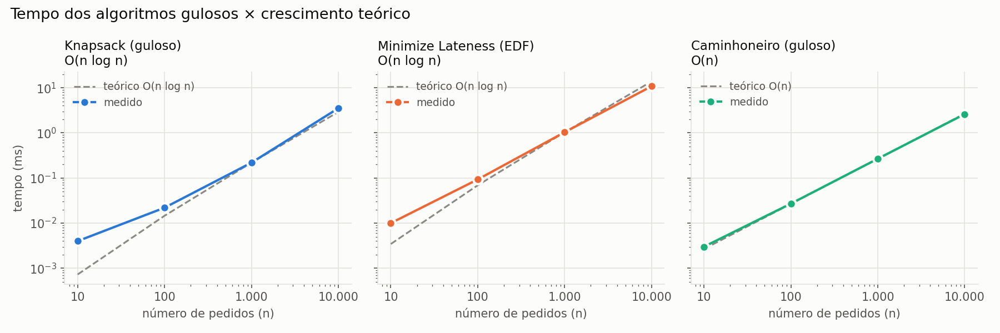

# Sistema de Otimização de Logística

Projeto da disciplina de Projeto e Análise de Algoritmos (UnB). Sistema simplificado de logística para uma transportadora, que integra três algoritmos de otimização (Knapsack, Minimize Lateness e Caminhoneiro) para planejar o transporte e a entrega de pedidos.

## Dupla

| Nome | Matrícula |
|---|---|
| Maria Clara Oleari de Araujo | 221008338 |
| Ana Júlia Mendes Santos | 221007798 |


## Descrição do problema

O sistema simula o planejamento logístico de uma transportadora: existe um **caminhão** com capacidade de carga e autonomia limitadas, vários **pedidos** com pesos, valores e prazos diferentes, e **postos de abastecimento** ao longo da rota. A partir desses dados, o sistema responde a três perguntas, cada uma resolvida por um algoritmo:

```
1. Quais pedidos devemos levar?   → KNAPSACK
2. Em qual ordem devemos entregar? → MINIMIZE LATENESS
3. Onde devemos abastecer?         → CAMINHONEIRO
```

Fluxo do sistema:

```
Pedidos → KNAPSACK → MINIMIZE LATENESS → CAMINHONEIRO → PLANO LOGÍSTICO
```

O resultado final apresenta as **cargas selecionadas, o valor total, a ordem das entregas, os atrasos e a quantidade de paradas para abastecimento**.

### Entrada

- **Pedidos:** id, peso, valor, prazo e distância
- **Caminhão:** capacidade de carga, autonomia e velocidade (converte a distância do pedido em tempo de entrega)
- **Rota:** destino e distância de cada posto na rota

Arquivo JSON, com exemplo em `data/exemplo.json`. Detalhes em [docs/formato-de-entrada.md](docs/formato-de-entrada.md).

### Algoritmos usados e por quê

| Etapa | Algoritmo | Estratégia | Por que é adequado |
|---|---|---|---|
| Seleção das cargas | Knapsack 0/1 | Guloso (maior valor/peso primeiro) | Escolhe sempre o pedido mais "rentável" por kg que ainda cabe; é rápido, mas no 0/1 não garante o ótimo (a DP serve de referência) |
| Ordem das entregas | Minimize Lateness | Guloso (Earliest Deadline First) | Ordenar por prazo crescente minimiza o maior atraso (prova por argumento de troca) |
| Paradas de abastecimento | Caminhoneiro | Guloso | Seguir até o posto mais distante ainda alcançável minimiza o número de paradas |

Cada algoritmo tem uma **versão principal** e uma **versão alternativa**, usada para comparação (por exemplo, a programação dinâmica no Knapsack, que é ótima e mostra quanto valor o guloso perde).

### Complexidade

| Algoritmo | Tempo | Espaço |
|---|---|---|
| Knapsack (guloso) | `O(n log n)` | `O(n)` |
| Knapsack (DP, referência) | `O(n·W)` | `O(n·W)` para reconstruir os pedidos escolhidos |
| Minimize Lateness (EDF) | `O(n log n)` | `O(n)` |
| Caminhoneiro (guloso) | `O(n)` com postos ordenados (`O(n log n)` se precisar ordenar) | `O(k)`, com `k` = número de paradas |

Onde `n` é o número de pedidos (ou postos) e `W` é a capacidade do caminhão.

### Saída

Cargas selecionadas, valor total (lucro esperado), ordem das entregas com conclusão e atraso de cada uma, maior atraso, postos de abastecimento escolhidos e total de paradas.

## Análise dos algoritmos

### Knapsack (seleção das cargas)

- **Estratégia:** gulosa. Ordena os pedidos por valor/peso decrescente e pega cada um que ainda couber na capacidade.
- **Complexidade:** tempo `O(n log n)` (dominado pela ordenação), espaço `O(n)`.
- **É ótimo?** Não. No knapsack 0/1 o pedido não pode ser dividido, então o guloso pode perder valor. Contra-exemplo (capacidade 300 kg): A = 100 kg / R$ 500 (razão 5), B = 200 kg / R$ 800 (razão 4), C = 150 kg / R$ 700 (razão 4,67). O guloso pega A + C (R$ 1.200), mas o ótimo é A + B (R$ 1.300). Só na versão fracionária o guloso é ótimo.
- **Alternativa (referência):** programação dinâmica, ótima. Tempo `O(n·W)`, espaço `O(n·W)` para reconstruir os pedidos escolhidos. Exige pesos e capacidade inteiros. Validada contra força bruta `O(2ⁿ)` em instâncias pequenas.

### Minimize Lateness (ordem das entregas)

- **Estratégia:** gulosa, Earliest Deadline First: entrega primeiro o pedido de menor prazo. O tempo de cada entrega é `distância / velocidade` e as entregas são feitas em sequência, sem tempo ocioso.
- **Corretude:** argumento de troca. Se dois pedidos consecutivos estão fora da ordem de prazo, trocá-los nunca aumenta o maior atraso; repetindo a troca chega-se à ordem EDF.
- **Complexidade:** tempo `O(n log n)` (ordenação), espaço `O(n)`.
- **Alternativa:** ordem de chegada (FIFO), `O(n)`, que mostra quanto o maior atraso piora sem a estratégia gulosa.

### Caminhoneiro (paradas de abastecimento)

- **Estratégia:** gulosa. De onde está, vai até o posto mais distante que ainda alcança com a autonomia e abastece nele; repete até o destino ficar ao alcance.
- **Corretude:** o guloso nunca fica atrás de qualquer outra solução: depois de `k` paradas, ele chegou pelo menos tão longe quanto qualquer solução com `k` paradas. Se não houver posto alcançável, a rota é inviável (`ValueError`).
- **Complexidade:** tempo `O(n)` com os postos ordenados (`O(n log n)` se for preciso ordenar), espaço `O(k)`, com `k` = número de paradas.
- **Alternativa:** abastecer em todos os postos, `O(n)`, que mostra quantas paradas o guloso economiza.

## Resultados experimentais

Pedidos aleatórios (semente fixa) com `n` = 10, 100, 1.000 e 10.000, capacidade fixa de 1.000 kg (a tabela da DP tem `(n+1)·(W+1)` células, então uma capacidade proporcional a `n` estouraria a memória), autonomia de 200 km e postos a cada ~50 km. Tempos em milissegundos, menor de 5 execuções (uma única execução para `n` = 10.000). Os números vêm de uma execução em uma máquina específica; rode `python src/benchmark.py` para refazer. A tabela completa fica em [data/resultados_benchmark.csv](data/resultados_benchmark.csv).

| n | Knapsack (guloso) | Knapsack (DP) | Lateness (EDF) | Lateness (FIFO) | Caminhoneiro | Caminhoneiro (todos) |
|---|---|---|---|---|---|---|
| 10 | 0,004 | 2,69 | 0,010 | 0,009 | 0,003 | 0,002 |
| 100 | 0,022 | 27,6 | 0,093 | 0,085 | 0,027 | 0,015 |
| 1.000 | 0,219 | 320 | 1,04 | 0,851 | 0,267 | 0,129 |
| 10.000 | 3,53 | 2.960 | 10,8 | 12,0 | 2,61 | 1,29 |

Tempo dos três algoritmos gulosos contra o crescimento teórico (a curva tracejada passa pelo ponto de `n` = 1.000; em `n` = 10 a medição é dominada por custo fixo e ruído, por isso a curva medida fica acima da teórica):



Qualidade das soluções (principal vs. alternativa):

| n | Valor guloso | Valor DP (ótimo) | Maior atraso EDF (h) | Maior atraso FIFO (h) | Paradas guloso | Paradas em todos os postos |
|---|---|---|---|---|---|---|
| 10 | 3.499 | 3.499 | 2,2 | 7,3 | 2 | 10 |
| 100 | 25.865 | 25.865 | 10,2 | 150,1 | 29 | 100 |
| 1.000 | 73.623 | 73.702 | 0 | 1.692 | 290 | 1.000 |
| 10.000 | 237.369 | 237.369 | 2,8 | 16.605 | 2.905 | 10.000 |

- **O crescimento bate com a teoria.** Cada vez que `n` multiplica por 10, o tempo do guloso do Knapsack e do EDF cresce de 10x a 16x nos tamanhos maiores (`n log n`); o Caminhoneiro e a DP crescem cerca de 10x. A DP é linear em `n` aqui porque `W` é fixo, e é de 600 a 1.500 vezes mais lenta que o guloso.
- **O guloso do Knapsack perde pouco em instâncias aleatórias:** só divergiu da DP em `n` = 1.000, por 0,1%. Os pedidos são pequenos perto da capacidade, então o espaço que sobra é pequeno. A perda é grande quando há poucos pedidos pesados, como no contra-exemplo acima (R$ 1.200 contra R$ 1.300, quase 8%).
- **EDF e o guloso do Caminhoneiro ganham de longe das alternativas:** o maior atraso do FIFO chega a 16.605 h contra 2,8 h do EDF, e o guloso faz de 3 a 5 vezes menos paradas que abastecer em todos os postos.

## Conclusão

Os três algoritmos gulosos resolvem cada etapa de forma rápida e simples. Dois deles (Minimize Lateness e Caminhoneiro) são ótimos, com prova de corretude. O Knapsack 0/1 é a exceção: o guloso é rápido (`O(n log n)`), mas não garante o ótimo, e a DP, que garante, custa `O(n·W)` em tempo e memória. Integrados, os três produzem um plano logístico completo (cargas, ordem de entrega e paradas) em milissegundos, mesmo com 10.000 pedidos.

## Exemplo de execução

Com os dados de `data/exemplo.json`:

```
=================================
       SISTEMA DE LOGÍSTICA
=================================

Pedidos recebidos: 3
Caminhão: capacidade 300 kg, autonomia 200 km
Rota: 500 km, 5 postos

Cargas selecionadas:
- Pedido A
- Pedido C

Lucro esperado:
R$ 1.200,00

Ordem das entregas:
1. Pedido A (conclusão em 3 h, prazo 8 h, atraso 0 h)
2. Pedido C (conclusão em 5 h, prazo 10 h, atraso 0 h)

Maior atraso:
0 horas

Paradas para abastecimento:
- Posto 170 km
- Posto 330 km

Total de paradas:
2
=================================
```

## Estrutura do repositório

```
G1_Greedy_PA-26.2/
├── src/
│   ├── main.py          # fluxo completo: pedidos -> knapsack -> lateness -> caminhoneiro
│   ├── modelos.py       # tipos (Pedido, Caminhao, Rota, Entrega) e leitura da entrada
│   ├── knapsack.py      # Knapsack (guloso) + DP de referência
│   ├── lateness.py      # Minimize Lateness (EDF) + alternativa FIFO
│   ├── caminhoneiro.py  # Caminhoneiro (guloso) + alternativa (todos os postos)
│   ├── benchmark.py     # experimentos de tempo (n = 10, 100, 1.000, 10.000)
│   └── grafico.py       # gráfico do tempo dos algoritmos gulosos (a partir do CSV)
├── data/
│   ├── exemplo.json              # exemplo de entrada (pedidos, caminhão, rota com postos)
│   └── resultados_benchmark.csv  # saída do benchmark
├── tests/
│   ├── test_entrada.py
│   ├── test_knapsack.py
│   ├── test_lateness.py
│   ├── test_caminhoneiro.py
│   ├── test_integracao.py   # fluxo completo
│   └── test_benchmark.py    # DP vs força bruta, gerador de dados
├── docs/
│   ├── formato-de-entrada.md
│   ├── assinaturas.md
│   ├── grafico_gulosos.png  # gráfico gerado por src/grafico.py
│   └── plano-de-commits-sistema-logistica.md  # plano de commits
├── pytest.ini
├── requirements.txt
├── LICENSE
└── README.md
```

## Como instalar

```bash
cd G1_Greedy_PA-26.2
python -m venv venv
venv\Scripts\activate
pip install -r requirements.txt
```

## Como rodar

```bash
python src/main.py
```

Roda o fluxo completo com os dados de `data/exemplo.json` e imprime o plano logístico no terminal. Também aceita outro arquivo de entrada: `python src/main.py caminho/entrada.json`.

Benchmark — mede o tempo de cada algoritmo (versão principal e alternativa) para `n` = 10, 100, 1.000 e 10.000 pedidos, compara a qualidade das soluções e salva a tabela em `data/resultados_benchmark.csv`:

```bash
python src/benchmark.py
```

Gráfico dos algoritmos gulosos (lê o CSV do benchmark e salva em `docs/grafico_gulosos.png`):

```bash
python src/grafico.py
```

## Como rodar os testes

```bash
pytest tests/ -v
```

## Cronograma

O plano de commits detalhado está em [docs/plano-de-commits-sistema-logistica.md](docs/plano-de-commits-sistema-logistica.md).

## Relatório e vídeo de apresentação

- Formato de entrada: [docs/formato-de-entrada.md](docs/formato-de-entrada.md)
- Assinaturas das funções e fluxo principal: [docs/assinaturas.md](docs/assinaturas.md)
- Análise de cada algoritmo (estratégia, complexidade, alternativa) e resultados experimentais: seções "Análise dos algoritmos" e "Resultados experimentais" deste README
- Vídeo de apresentação: _a ser adicionado_
